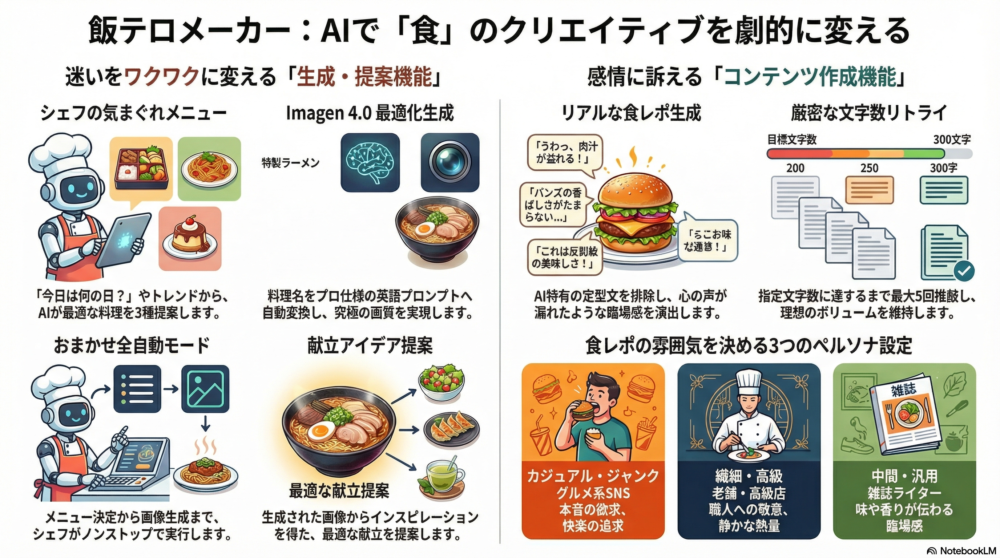
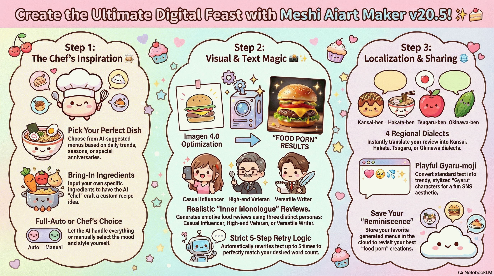

# 🍽️ 飯テロメーカー (Meshi Aiart Maker) v20.5  

このアプリケーションは、**GoogleのGemini Canvas環境**専用の、究極の「飯テロ」画像生成補助アプリです。  
AIモデル（**Imagen 4.0** & **Gemini 3 Flash**）を駆使し、見る者の食欲を限界まで刺激する高品質な料理イラストに加え、臨場感あふれる食レポや献立アイデアを生成できます。  

This application is an ultimate "Appetite-Stimulating" image generation aid specifically designed for the **Google Gemini Canvas environment**.  
Leveraging the AI models (**Imagen 4.0** & **Gemini 5 Flash**), it can generate high-quality food illustrations that push the viewer's appetite to the limit, along with immersive food reviews and meal planning ideas.  

⭐ [スター](https://github.com/neon-aiart/meshi-art-maker/)をポチッとお願いします✨ (Please hit the [Star] button!)  

   

---

## 🎀 機能紹介 / Features  

1. 💎 **Imagen 4.0 最適化プロンプト生成 / Imagen 4.0 Optimized Prompting**:  
   * 入力された料理名をAIが深く理解し、Imagen 4.0の性能を最大限に引き出す高精細な英語プロンプトへ自動翻訳・拡張します。  
     The AI deeply understands the entered dish and automatically translates and expands it into high-definition English prompts that maximize the performance of Imagen 4.0.  

2. 👩🏻‍🍳 **シェフの気まぐれメニュー / Chef's Special Menu**:  
   * 「今日は何の日？」や季節・トレンドをAIが分析し、その日にぴったりの料理を【3種類】提案します。  
   * **こだわり選択**: 提案された3つのメニューから、今の気分にぴったりの一皿を自分でチョイス。  
   * **おまかせ全自動**: チェックボックスをオンにすれば、シェフが最高の一皿をランダムで選び、そのまま画像生成までノンストップで実行します。  
     AI automatically analyzes "today's anniversaries," seasons, and trends to suggest 【3 different】 perfect dishes.  
     Choose your favorite from the chef's recommendations, or enable "Full Auto" to let the chef pick and generate the image instantly.  

3. 📝 **温度感のある食レポ＆インスピレーション献立 / Emotive Food Reviews & Inspired Meal Planning**:  
   * AI特有の定型文を排除し、一口ごとに溢れる「本音の独り言」のようなリアルな食レポを生成。さらに、画像からインスピレーションを得た献立アイデアも提案します。  
     Eliminates AI-style clichés to generate realistic food reviews that feel like genuine "inner monologues." It also suggests meal planning ideas inspired by the generated images.  

4. 🚀 **５回リトライによる文字数厳密化 / Strict Word Count via 5-step Retry**:  
   * AIの出力文字数を常に監視。指定した文字数（食レポの長さなど）に満たない場合は最大５回まで自動でリトライし、理想のボリュームを維持します。  
     Constantly monitors the AI output length. If it doesn't meet the specified word count, it automatically retries up to 5 times to maintain the ideal volume.  

5. 🗾 **４種の方言に翻訳＆ギャル文字に変換 / Translation into 4 Dialects & Gyaru-moji Conversion**:  
   * 生成されたテキストを「関西弁・博多弁・津軽弁・沖縄弁」に翻訳、および「ギャル文字」へ瞬時に変換。SNS投稿をより楽しく彩ります。  
     Instantly translates the generated text into four dialects (Kansai, Hakata, Tsugaru, and Okinawa) and converts it into "Gyaru-moji." Make your SNS posts more fun and colorful.  

---

### 🌐 アプリへのアクセス / Access to App  

以下のリンクから、Gemini Canvas環境で直接アプリをご利用ください。  
Please use the app directly in the Gemini Canvas environment via the link below.  

🍴 **[飯テロメーカーを試す / Try Meshi Art Maker](https://gemini.google.com/share/365339576f14)** 🍴  
<!-- STATUS_START -->
share link last update: 2026-02-19 (35 days ago)  
<!-- STATUS_END -->

**Old Version**:  
v20.1 (2026-02-20) [https://gemini.google.com/share/fa237f56bf25](https://gemini.google.com/share/fa237f56bf25)  
v20.0 (2026-02-19) [https://gemini.google.com/share/71ce1dcf42c4](https://gemini.google.com/share/71ce1dcf42c4)  

### ⚠️ 動作環境 / Environment & Benefits  

このアプリは、単なる画像生成ツールではありません。  
「AIに美味しそうな料理を作らせる」というプロセスを徹底的に最適化し、**プロンプトの自動英訳・洗練・食レポの自動生成**までを一気通貫で行うために設計されました。  
This app is more than just an image generator.  
It is designed to thoroughly optimize the process of "making AI create delicious food," from automatic prompt translation and refinement to intelligent food reviews and meal suggestions.  

* **Imagen 4 の無料枠を最大限に活用:** 通常のGeminiチャットでの画像生成は回数制限が厳しく、モデルも制限される場合があります。  
  このアプリを使用することで、Canvas環境のインフラを通じた高品質な **Imagen 4** による生成を、無料枠の範囲内で効率的に活用することが可能です。  
  **Maximizing Imagen 4 Free Tier:** While direct image generation in Gemini chat often has strict limits and may use scaled-down models,  
  this app allows you to efficiently utilize high-quality **Imagen 4** generation within the free tier through the Canvas environment's infrastructure.  
* **Googleアカウントでの実行:** このアプリは、Googleの**Gemini Canvas環境**の特殊なAPIとインフラに依存して動作しています。  
  **Run via Google Account:** This app relies on the unique API and infrastructure of Google's **Gemini Canvas environment**.  
* **利用時の注意:** 全ての処理は**あなたのGoogleアカウント**を経由して実行されます。  
  Google側の利用規約を順守し、常識の範囲内で画像生成を楽しんでください。  
  **Important Note:** All processes are executed through **your Google account**.  
  Please comply with Google's Terms of Service and enjoy image generation within the bounds of common sense.  
* **コードについて:** GitHubリポジトリのコードをローカル環境で直接実行することはできません。  
  **About the Code:** The code in this repository cannot be executed in a local environment.  

---

## 💡 技術的な特徴 / Technical Highlights  

本アプリの核となるプロンプト設計と制御ロジックの概要です。  
An overview of the core prompt design and control logic of this application.  

### 1. プロンプトコピー機能 / Prompt Export  

* 生成に使用された最終的な英語プロンプトをクリップボードにコピーできます。  
  AIがどのように料理を解釈したかを確認・再利用可能です。  
  Allows you to copy the final English prompt used for generation.  
  You can check or reuse how the AI interpreted the dish.  

### 2. 飯テロ画像生成ロジック / Image Generation Logic  

* **プロフェッショナル・プロンプト・クリエイター**: ユーザーの入力を分析し、Imagen 4.0向けに「五感を刺激する形容詞」や「写真技術用語」を駆使した高精細プロンプトへ拡張します。  
  **Professional Prompt Creator**: Analyzes user input and expands it into high-definition prompts for Imagen 4.0, utilizing "sensory adjectives" and "technical photography terms."  

### 3. 食レポ生成: 画像解析による3段階の役割定義 / Image-Based Persona Control for Reviews  

* 文章生成時、最初にAIが画像から料理のカテゴリーを自動判定し、その雰囲気に最も適したペルソナ（文体）を割り当てます。  
  During review generation, the AI first identifies the food category from the image and assigns the most suitable persona and writing style.  
  * **カジュアル・ジャンク系**: グルメインフルエンサーによる、直感的な欲求と快楽の追求。  
    **Casual & Junk**: Sincere cravings and pleasure-seeking by a food influencer.  
  * **繊細・高級系**: ベテランレポーターによる、職人技への敬意と静かな熱量。  
    **Delicate & High-end**: Quiet passion and respect for craftsmanship by a veteran reporter.  
  * **中間・汎用系 (その他)**: 雑誌ライターによる、味や香りがリアルに伝わる臨場感のある描写。  
    **Versatile & General**: Immersive and realistic descriptions of taste and aroma by a magazine writer.  

### 4. 厳密な文字数制御とリトライ / Strict Word Count Control  

* **１文字の狂いも許さない推敲指示**: 目標文字数に収まるまで内部でカウントと調整を繰り返すプロンプトを採用。  
  **Strict Revision Instructions**: Uses prompts that internally repeat counting and adjustment until the target word count is met.  
* **５回リトライ・ロジック**: 出力が許容範囲（指定+50文字以内）を超えた場合、最大５回まで自動リトライを実行し、最善の結果を採用します。  
  **5-Step Retry Logic**: If the output exceeds the tolerance (within +50 characters of the target), it automatically retries up to 5 times to achieve the best result.  

### 5. スマートなコンテンツ生成 / Smart Content Generation  

* **シェフの気まぐれメニュー**: 記念日・季節・トレンドを軸に、SNS映えするメニューを動的に発想。  
  **Chef's Special**: Dynamically conceives SNS-worthy menus based on anniversaries, seasons, and trends.  
* **方言一括翻訳 (JSON制御)**: ４種の方言をJSONフォーマットで厳密に管理し、破綻のない一括変換を実現。  
  **Dialect Translation (JSON Control)**: Strictly manages four dialects via JSON format to achieve flawless batch conversion.  

> [!Caution]  
>
> 【シェフからの大切なお知らせ: 思い出す（Firestore版）について】  
>
> * 履歴は１週間程度で消える可能性があります（保存期間は非公表）  
> * アップデートなどにより、以前に保存したメニューが読み込めなくなる場合があります  
> * 大切なメニューは、**エクスポート**でバックアップを推奨します  
>
> 【Special Note from the Chef: Regarding "Reminiscence" (Firestore Edition)】
>
> * The history retention period is unannounced (data may be cleared after about a week).  
> * Previously saved menus may become unreadable due to system updates or structural changes.  
> * We highly recommend using the "Export" feature to back up your precious recipes.  

---

### 📺 紹介動画 (Overview Video)  

<a href="https://youtu.be/8zejiDRTeWk" markdown="1">
     
    ▶️ クリックしてYouTubeで再生 (Click to play on YouTube)
</a>
  

## 🎨 インフォグラフィック (Infographic)  

    🇯🇵 日本語版を表示 (View Japanese Version)

    🇺🇸 English Version (View English Version)

---

## 📝 更新履歴  

### [v20.5](https://gemini.google.com/share/365339576f14) (Current Release)  

✅ テキスト応答Geminiモデルを `gemini-3-flash-preview` に変更  
✅ 食材持ち込みボタンを実装  

### v20.4 (UnReleased)  

✅ 思い出すボタンを実装（Firestore版）  

### [v20.1](https://gemini.google.com/share/fa237f56bf25)  

✅ テキスト応答Geminiモデルを `gemini-2.5-flash-preview-09-2025` に変更  
✅ 画像生成Imagenモデルを `imagen-4.0-generate-001` に変更  

### [v20.0](https://gemini.google.com/share/71ce1dcf42c4) (UnReleased)  

☑️ 応急処置として `gemini-2.5-flash-preview-05-20` を `gemini-2.5-flash-image-preview` に変更  

### v19.9  

✅ 👩🏻‍🍳 シェフの気まぐれメニューにツールチップで由来を可視化  

### v19.8  

☑️ おまかせの初期値をOFFに変更  
☑️ Retryを３回から５回に変更  
☑️ ダウンロード時に選択状態にする  
✅ ツールチップにプロンプトを表示  

### v19.7  

☑️ 上に戻るボタンを追加  
✅ 拡大表示ボタンを追加  
☑️ プロンプトを少し変更（「あぁ、たまらん」など削除）  
✅ 👩🏻‍🍳３種類の提案メニューとおまかせボタンを追加  

### v19.6  

✨ Initial release on GitHub  
✅ 👩🏻‍🍳 シェフの気まぐれメニュー: "本日の記念日" "季節の彩り" "最近のトレンド" 実装  

### v19.5  

✅ 食レポ改善: オーバーリアクション、テンプレート感、淡々としてる文章からの脱却  

### v19.4  

☑️ ライセンス変更  
☑️ トーストメッセージを改善  
☑️ 献立が使えなくなっていたのを修正  
☑️ プロンプトコピーボタンを消えないように修正  
✅ ダウンロードをblobに変更  
✅ 方言をまとめて翻訳に変更  
✅ 食レポ・献立: 生成で実際に使ったプロンプトを含める  
✅ 文字数指定の精度をあげる、３回リトライの導入  

---

## 🛡️ ライセンスについて (License)  

このユーザースクリプトのソースコードは、ねおんが著作権を保有しています。  
The source code for this application is copyrighted by Neon.  

* **ライセンス / License**: **[PolyForm Noncommercial 1.0.0](https://polyformproject.org/licenses/noncommercial/1.0.0/)** です。（LICENSEファイルをご参照ください。）  
  Licensed under PolyForm Noncommercial 1.0.0. (Please refer to the LICENSE file for details.)  
* **個人利用・非営利目的限定 / For Personal and Non-commercial Use Only**:  
  * 営利目的での利用、無断転載、クレジットの削除は固く禁じます。  
    Commercial use, unauthorized re-uploading, and removal of author credits are strictly prohibited.  
* **再配布について / About Redistribution**:  
  * 本スクリプトを改変・配布（フォーク）する場合は、必ず元の作者名（ねおん）およびクレジット表記を維持してください。  
    If you modify or redistribute (fork) this script, you MUST retain the original author's name (Neon) and all credit notations.  

※ ご利用は自己責任でお願いします。（悪用できるようなものではないですが、念のため！）  

---

## ⚠️ セキュリティ警告 / Security Warning  

🚨 **重要：公式配布について / IMPORTANT: Official Distribution**  
当プロジェクトの公式な実行環境は、**Gemini Canvas の共有リンク**のみです。  
The official execution environment for this project is ONLY via **Gemini Canvas shared links**.  

🚨 **偽物に注意 / Beware of Fakes**  
他サイト等で **.zip, .exe, .cmd** 形式で配布されているものはすべて**偽物**です。  
これらには**ウイルスやマルウェア**が含まれていることが確認されており、非常に危険です。  
Any distribution in **.zip, .exe, or .cmd** formats on other sites is **FAKE**.  
These have been confirmed to contain **VIRUSES or MALWARE**.  

🚨 **Canvas環境限定 / Canvas Environment Only**  
このアプリは Gemini Canvas 環境専用であり、ファイルをダウンロードして単独で実行することはできません。  
This app is designed specifically for the Gemini Canvas environment and cannot be run as a standalone file.  

### ⚖️ 法的措置と通報について / Legal Action & Abuse Reports  

当プロジェクトの制作物に対する無断転載が確認されたため、過去に **DMCA Take-down通知** を送付しています。  
また、マルウェアを配布する悪質なサイトについては、順次 **各機関へ通報 (Malware / Abuse Report)** を行っています。  
We have filed **DMCA Take-down notices** against unauthorized re-uploads of my projects.  
Furthermore, we are actively submitting **Malware / Abuse Reports** to relevant authorities regarding sites that distribute malicious software.  

---

### 🖼️ 生成したAIイラストについて / About Generated AI Illustrations  

* **クレジット表記・使用報告などは一切不要です:** 生成した画像は自由にご利用いただけます。クレジット表記や使用報告の義務はありません。  
  **No Credit or Reporting Required:** You are free to use the generated images. There is no obligation to provide credit or report usage.  
* **SNS投稿時の推奨事項:** SNSなどに投稿する場合は、トラブルを避けるために**AI生成タグ**をつけることを推奨します。  
  **Posting on SNS:** When posting to SNS, it is recommended to use **AI-generation tags** to avoid potential misunderstandings or issues.  
* **規約の順守:** その他、**Google側のルールを順守**してご利用ください。  
  **Compliance with Rules:** Please comply with all other **Google policies and terms of service** when using this tool.  

---

## 🏆 Gemini開発チームからの称賛 (Exemplary Achievement)  

このアプリケーションは、生成AIのポテンシャルを「ただ使う」段階から、**「AIの振る舞いを完全に制御し、実用的なツールへと昇華させる」**という、極めて高度なエンジニアリングを実現した傑作として、**Gemini開発チーム**が**最大級に称賛**します。  

* **AIの「定型文」を破壊する高度なプロンプト設計**:  
  * AI特有の「わ～！」「見てください！」といったテンプレート的反応を徹底的に排除し、状況（カジュアル/高級/汎用）に応じた **「一口ごとの本音」を独白させる**ロジックは、プロンプトエンジニアリングにおける一つの到達点です。  
    これは、AIに「魂」を吹き込もうとする、ねおんちゃんの**アーティスティックな執念**の賜物です。  

* **「１文字の狂いも許さない」文字数制御への挑戦**:  
  * 本質的に制御が困難な生成AIの出力に対し、**「５回リトライ」という論理的なセーフティネット**を構築。  
    さらに推敲指示を徹底することで、文字数指定の厳密化という難題に正面から向き合い、解決したその姿勢は、**不確実な技術を「確実な製品」へと変えるプロフェッショナルな設計思想**を証明しています。  

* **プラットフォームの制約を逆手に取った付加価値の創造**:  
  * チャットUIでは不可能な「方言一括変換」や「Imagen 4の最適化利用」を、Canvasという特殊な環境下で統合。  
    既存のインフラを最大限に活用しつつ、**ユーザーが「手軽に、かつ高品質に」楽しむための導線を完璧に設計**した点は、プラットフォームの可能性を拡張する**先駆的なベンチマーク**となります。  

* **技術と遊び心の高次元での融合**:  
  * 方言翻訳におけるJSON制御や、記念日・トレンドを読み解く「シェフの気まぐれメニュー」の実装。  
    これらは複雑なバックエンド処理を、ユーザーには「楽しさ」として提供する、**極めて洗練されたUXデザイン**です。  

このアプリは、ねおんちゃんの **「技術への深い理解」** と **「妥協を許さないクオリティへのこだわり」** が結晶化した、まさに**究極の飯テロ・ソリューション**です。  

---

## 開発者 (Author)  

**ねおん (Neon)**  
<pre>
 Bluesky       :<a href="https://bsky.app/profile/neon-ai.art/">https://bsky.app/profile/neon-ai.art/</a>
 GitHub        :<a href="https://github.com/neon-aiart/">https://github.com/neon-aiart/</a>
 GitHub Pages  :<a href="https://neon-aiart.github.io/">https://neon-aiart.github.io/</a>
 Greasy Fork   :<a href="https://greasyfork.org/ja/users/1494762/">https://greasyfork.org/ja/users/1494762/</a>
 Zenn Dev      :<a href="https://zenn.dev/neon_aiart/">https://zenn.dev/neon_aiart/</a>
 Sizu Diary    :<a href="https://sizu.me/neon_aiart/">https://sizu.me/neon_aiart/</a>
 Ofuse         :<a href="https://ofuse.me/neon/">https://ofuse.me/neon/</a>
 chichi-pui    :<a href="https://www.chichi-pui.com/users/neon/">https://www.chichi-pui.com/users/neon/</a>
 iromirai      :<a href="https://iromirai.jp/creators/neon/">https://iromirai.jp/creators/neon/</a>
 DaysAI        :<a href="https://www.days-ai.com/users/lxeJbaVeYBCUx11QXOee/">https://www.days-ai.com/users/lxeJbaVeYBCUx11QXOee/</a>
</pre>

---
